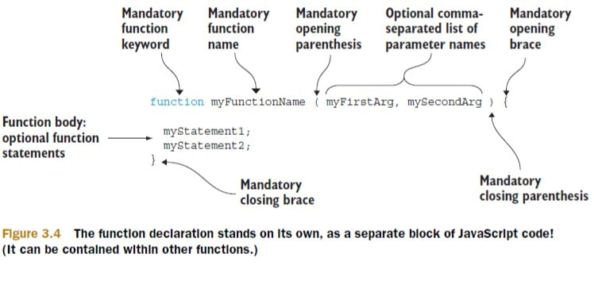
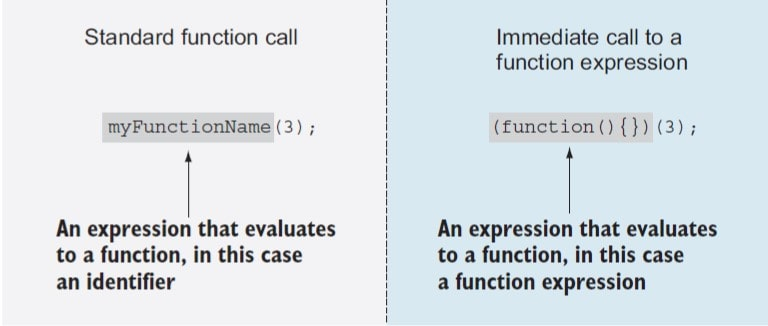
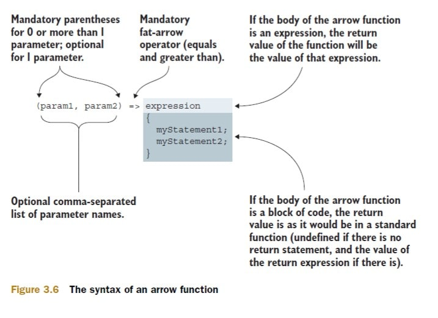

# Chapter 3: First-class functions for the novice: definitions and arguments (Now with Muppets)

## Table of Contents

- [Chapter 3: First-class functions for the novice: definitions and arguments (Now with Muppets)](#chapter-3-first-class-functions-for-the-novice-definitions-and-arguments-now-with-muppets)
  - [Table of Contents](#table-of-contents)
  - [Chapter Overview](#chapter-overview)
  - [Questions To Consider](#questions-to-consider)
  - [3.0 Introduction](#30-introduction)
  - [3.1 - What's With The Functional Difference?](#31---whats-with-the-functional-difference)
    - [3.1.1 - Functions As First-class Objects](#311---functions-as-first-class-objects)
    - [3.1.2 - Callback Functions](#312---callback-functions)
    - [Callback Example #1](#callback-example-1)
    - [Callback Example #2](#callback-example-2)
    - [3.1.3 - Sorting With A Comparator](#313---sorting-with-a-comparator)
  - [3.2 - Fun With Functions As Objects](#32---fun-with-functions-as-objects)
    - [3.2.1 - Storing Functions](#321---storing-functions)
    - [3.2.2 - Self-memoizing Functions](#322---self-memoizing-functions)
  - [3.3 - Defining Functions](#33---defining-functions)
    - [3.3.1 Function Declarations and Function Expressions](#331-function-declarations-and-function-expressions)
      - [Function declarations](#function-declarations)
      - [Function Expressions](#function-expressions)
      - [Immediate Functions](#immediate-functions)
    - [3.3.2 -  Arrow functions](#332----arrow-functions)
  - [3.4 - Arguments and Function Parameters](#34---arguments-and-function-parameters)
    - [3.4.1 Rest Parameters](#341-rest-parameters)
    - [3.4.2 - Default Parameters](#342---default-parameters)
  - [3.5 Summary](#35-summary)
  - [3.6 Exercises](#36-exercises)
    - [1. In the following code snippet, Which functions are callbacks?](#1-in-the-following-code-snippet-which-functions-are-callbacks)
      - [Answer for Question 1](#answer-for-question-1)
    - [2. In the following snippet, categorize functions according to their type (function declaration, function expression, or arrow function).](#2-in-the-following-snippet-categorize-functions-according-to-their-type-function-declaration-function-expression-or-arrow-function)
      - [Answer for Question 2](#answer-for-question-2)
    - [3. After executing the following code snippet, what are the values of variables muppetCharacter and sesameStreetCharacter?](#3-after-executing-the-following-code-snippet-what-are-the-values-of-variables-muppetcharacter-and-sesamestreetcharacter)
      - [Answer for Question 3](#answer-for-question-3)
    - [4. Within the body of the test function, what are the values of parameters a, b, and c for the two function calls?](#4-within-the-body-of-the-test-function-what-are-the-values-of-parameters-a-b-and-c-for-the-two-function-calls)
      - [Answer for Question 4](#answer-for-question-4)
    - [5. After executing the following code snippet, what are the values of the message1 and message2 variables?](#5-after-executing-the-following-code-snippet-what-are-the-values-of-the-message1-and-message2-variables)
      - [Answer for Question 5](#answer-for-question-5)

## Chapter Overview

This chapter covers:

* Why understanding functions is so crucial
* How functions are first-class objects
* The ways to define a function
* The secrets of how parameters are assigned


## Questions To Consider

* In what situations might callback functions be used synchronously? What about Asynchronously?
* What's the difference between an arrow function and a function expression?
* Why might you need to use the default parameter values in a function?

[Back to the top of the page](#chapter-3-first-class-functions-for-the-novice-definitions-and-arguments-now-with-muppets)

## 3.0 Introduction

**TLDR:** 
* JavaScript **functions** are **first-class objects**, or **first-class citizens** as they’re often called. They coexist with, and **can be treated like, any other JavaScript object**.
* JavaScript **functions** can be **referenced by variables**, **declared with literals**, and **even passed as function parameters**.

[Back to the top of the page](#chapter-3-first-class-functions-for-the-novice-definitions-and-arguments-now-with-muppets)

## 3.1 - What's With The Functional Difference?

First, lets take a look at the Object capabilities in JavaScript:

* They can be created via literals: {}
* They can be assigned to variables, array entries, and properties of other objects:
```js
// Assigns a new object to a variable
const muppet = {};
// Adds a new object to an array
muppetArray.push({});
// Assigns a new object as a property of another object
muppet.data = {};
```
* They can be passed as arguments to functions:
```js
function hide(muppet) {
  muppet.visibility = false;
}
// A newly created object passed as an argument to a function
hide({});
```
* They can be returned as values from functions:
  
```js
function returnNewMuppet() {
  // returns a new object from a function
  return {};
}
```
* They can possess properties that can be dynamically created and assigned

```js
const muppet = {};
// Creates a new property of an object
muppet.name = "Kermit";
console.log(muppet.name); // prints "Kermit"
```

[Back to the top of the page](#chapter-3-first-class-functions-for-the-novice-definitions-and-arguments-now-with-muppets)

### 3.1.1 - Functions As First-class Objects

Since functions are **first-class objects**, they can do the same things as objects:

* They can be created via literals:

```js
function muppetFunction() {}
```
* They can be assigned to variables, array entries, and properties of other objects:
```js
// Assigns a new function to a variable
const muppetFunction = function() {};
// Adds a new function to an array
muppetArray.push(function(){});
// Assigns a new function as a property of another object
muppet.data = function(){};
```
* They can be passed as arguments to functions:
```js
function call(muppetFunction) {
  muppetFunction();
}
// A newly created object passed as an argument to a function
call(function(){});
```
* They can be returned as values from functions:
  
```js
function returnNewMuppetFunction() {
  // returns a new object from a function
  return function(){};
}
```
* They can possess properties that can be dynamically created and assigned

```js
const muppetFunction = function(){};
// Creates a new property of an object
muppetFunction.name = "Fozzie";
console.log(muppetFunction.name); // prints "Fozzie"
```

**NOTE:** Whatever we can do with objects, we can do with functions as well. Functions are objects, just with an additional, special capability of being invocable: Functions can be called or invoked in order to perform an action.

[Back to the top of the page](#chapter-3-first-class-functions-for-the-novice-definitions-and-arguments-now-with-muppets)

### 3.1.2 - Callback Functions

The term **callback** stems from the fact that we’re establishing a function that other code will later “call back” at an appropriate point of execution.


### Callback Example #1

```js
let text = "Hi Ho! Kermit the Frog here!";
console.log("Before defining functions!");


function useless(muppetCallback) {
  // defines a function that takes a callback function and immediately invokes it 
  console.log("In useless function");
  return muppetCallback();
}

// Defines a simple function that returns a global variable
// getText is the argument to the useless function
function getText() {
  console.log("In getText function");
  return text;
}

console.log("Before making all the calls");
// Calls our useless function with the getText function as a callback
// calling useless(getText) will trigger the execution of the useless function, which will, in turn, trigger the execution of the getText function.
let secondText = useless(getText)

// If they match, console.log success message
if (text === secondText) {
  console.log("The useless function works! " + text);
}

console.log("After the calls have been made");
```

Here is the flow of execution with the code above:

* The `useless` function is called with `getText` as an argument.
  * In the body of the `useless` function is a call to the passed-in function.
  * This will trigger the execution of the `getText` function. (We have "Called back" to the `getText` function).
  * `getText` will return the global variable `text`.

### Callback Example #2

```js
document.body.addEventListener("mousemove", function() {
  let second = document.getElementById("second");
  addMessage(second, "Event: mousemove");
})
```

[Back to the top of the page](#chapter-3-first-class-functions-for-the-novice-definitions-and-arguments-now-with-muppets)

### 3.1.3 - Sorting With A Comparator

Let’s say that we have an array of numbers in a random order: 0, 3, 2, 5, 7, 4, 8, 1. That order might be just fine, but chances are that, sooner or later, we’ll want to rearrange it.

Instead of letting the sort algorithm decide what values go before other values, we’ll provide a function that performs the comparison. We’ll give the sort algorithm access to this function as a callback, and the algorithm will call the callback whenever it needs to make a comparison. The callback is expected to:
* Return a positive number if the order of the passed values should be reversed
* Return a negative number if not, 
* Return zero if the values are equal

Subtracting the compared values produces the desired return value to sort the array:

```js
let values = [0, 3, 2, 5, 7, 4 8, 1];
let sortedValues = values.sort(function (value1, value2) {
  return value1 - value2;
});

console.log(sortedValues); // prints [0, 1, 2, 3, 4, 5, 7, 8]
```

[Back to the top of the page](#chapter-3-first-class-functions-for-the-novice-definitions-and-arguments-now-with-muppets)

## 3.2 - Fun With Functions As Objects

One capability that might be surprising is that there’s nothing stopping us from attaching properties to functions:

```js
// Create an object
let muppet = {}
// Add a new property to the object
muppet.name = "Fozzie";
console.log(muppet.name); // prints "Fozzie"

// Create a new function
let wieldChicken = function(){};
// Assign a new property to the function
wieldChicken.chickenType = "rubber"; 
console.log(wieldChicken.chickenType); // prints "rubber"
```

Let’s look at a couple of the more interesting things that can be done with this capability:

* Storing functions in a collection allows us to easily manage related functions—for example, callbacks that have to be invoked when something of interest occurs.
* Memoization allows the function to remember previously computed values,
thereby improving the performance of subsequent invocations.

[Back to the top of the page](#chapter-3-first-class-functions-for-the-novice-definitions-and-arguments-now-with-muppets)

### 3.2.1 - Storing Functions

Let's take a look at storing a collection of unique functions:

```js
/**
* nextId keeps track of the next available id to be assigned
* cache is an object that will serve as a caches in which we'll store functions
* add function ass to the cache, but only if they are unique
*/
let store = {
  nextId: 1,
  cache: {},
  add: function(fn) {
    // if the id does not exist
    if (!fn.id) {
      // get nextId
      fn.id = this.nextId++;
      //add function value to cache with the id as the property key
      this.cache[fn.id] = fn;
      // return boolean for future check
      return true;
    }
  }
}

function muppet(){};
if (store.add(muppet)) {
  console.log("Function was safely added.");
} else if (!store.add(muppet)) {
  console.log("But it was only added once.");
}
```

[Back to the top of the page](#chapter-3-first-class-functions-for-the-novice-definitions-and-arguments-now-with-muppets)

### 3.2.2 - Self-memoizing Functions

**Memoization** is the process of building a function that’s capable of remembering its previously computed values.

Whenever a function computes its result, we store that result alongside the function arguments. In this way, when another invocation occurs for the same set of arguments, we can return the previously stored result, instead of calculating it anew.

As an example, let’s look at a simplistic (and certainly not particularly efficient) algorithm for computing prime numbers:

```js
function isPrime(value) {
  // if cache is not created yet
  if (!isPrime.answers) {
    // create cache
    isPrime.answers = {};
  }
  // checks for cached values
  if (isPrime.answers[value] !== undefined) {
    // if there is a match, return it
    return isPrime.answers[value];
  }

  let prime = value !== 1; // 1 is not a prime number

  for (let i = 2; i < value; i++) {
    if (value % i === 0) {
      prime = false;
      break;
    }
  }
  // Stores the computed value
  return isPrime.answers[value] = prime;
}

// If it returns true, its a prime number
if (isPrime(5)) {
  console.log("5 is prime!");
}
// If this returns true, it is stored in the cache
if (isPrime.answers[5]) {
  console.log("The answer was cached!");
}
```

This approach has two major advantages:

* The end user enjoys performance benefits for function calls asking for a previously computed value.
* It happens seamlessly and behind the scenes; neither the end user nor the page author needs to perform any special requests or do any extra initialization in order to make it all work.

But it’s not all roses and violins; its disadvantages may need to be weighed against its advantages:

* Any sort of caching will certainly sacrifice memory in favor of performance.
* Purists may consider that caching is a concern that shouldn’t be mixed with the business logic; a function or a method should do one thing and do it well. But don’t worry; in chapter 8, you’ll see how to tackle this complaint.
* It’s difficult to load-test or measure the performance of an algorithm such as this one, because our results depend on the previous inputs to the function.

[Back to the top of the page](#chapter-3-first-class-functions-for-the-novice-definitions-and-arguments-now-with-muppets)

## 3.3 - Defining Functions 

You can define functions into 4 groups

* __Function Declarations and Function Expressions__

```js
// function declaration
function myFun() { return 1; }

// function expression
const mySecondFun = function() {
  return 2;
}
```

* __Arrow Functions (AKA Lambda Functions)__

```js
// function declaration
function double (myArg) {
  return myArg * 2; 
}
// Arrow function expression
const doubleInEs6 = myArg => myArg * 2;
```

* __Function Constructors (rarely used)__

```js
new Function('a', 'b', 'return a + b');
```

* __Generator Functions__ - This ES6 addition to JavaScript enable us to create functions that, unlike normal functions, can be exited and reentered later in the application execution, while keeping the values of their variables across these re-entrances. We can define generator versions of function declarations, function expressions, and function constructors:

```js
function* myGen(){ yield 1};
```

[Back to the top of the page](#chapter-3-first-class-functions-for-the-novice-definitions-and-arguments-now-with-muppets)

### 3.3.1 Function Declarations and Function Expressions

#### Function declarations

The most basic way of defining a function in JavaScript is by using function declarations (see below):



[Source: Secrets of a JavaScript Ninja, 2nd edition (Resig, Bibeault, Maras)](https://www.manning.com/books/secrets-of-the-javascript-ninja-second-edition)

Every function:

* Starts with a mandatory `function` keyword
* followed by a mandatory function name
* A list of optional comma-separated `parameter` names enclosed within mandatory parenthesis
* A function body that is enclosed with an opening/closing {}


**NOTE:** * JavaScript functions must be placed on its own, as a separate JavaScript statement (but can be contained within another function or a block of code)

Here is a few examples of properly declared functions:

```js
// Defines function muppet in the global scope
function muppet() {
  return "muppet here";
}

// Defines function  tinyMuppet in the global scope
function tinyMuppet() {
  //Defines function findTinyMuppet in the muppet function scope
  function hiddenTinyMuppet() {
    return "Pepe the King Prawn here";
  }

  return hiddenTinyMuppet();
}
```

#### Function Expressions

JavaScript are `first-class objects`, which, among other things, means that they can be created via literals, assigned to variables and properties, and used as arguments and return values to and from other functions.

So in this case, we can assign a variable to represent a function literal.

Such functions that are always a part of another statement (for example, as the right side of an assignment expression, or as an argument to another function) are called `function expressions`.

Function expressions are great because they allow us to define functions exactly where we need them, in the process making our code easier to understand.


The following example shows the difference between function declarations and function expressions:

```js
/* function declarations are separate statements of JavaScript code, but can be contained within the body of other functions. */

// Standalone function declaration
function myfunctionDeclaration() {
  // inner function declaration
  function innerFunction() {}
}

/* In contrast function expressions are always a part of another statement. */

// Function expression as a part of a variable declaration assignment
const myFunc = function() {};
// function expression as an argument of a function call
myFunc(function() {
  // function expression as a function return value
  return function() {};
});

// Named function expression as part of a function call that will be immediately invoked
(function namedFunctionExpression() {
  return function(){};
})();

// Function expressions that will be invoked, as arguments to unary operators
console.log(+function() {}); // prints NaN
console.log(-function() {}); // prints NaN
console.log(!function() {}); // prints false
console.log(~function() {}); // prints -1
```

#### Immediate Functions

Let's take a look a a function call and a IIFE (Immediately invoked function expression):



[Source: Secrets of a JavaScript Ninja, 2nd edition (Resig, Bibeault, Maras)](https://www.manning.com/books/secrets-of-the-javascript-ninja-second-edition)

*NOTE:* You might ask yourself Why do we even need () around the IIFE? The reason is purely syntactical. The JavaScript parser has to be able to easily differentiate between function declarations and function expressions.

[Back to the top of the page](#chapter-3-first-class-functions-for-the-novice-definitions-and-arguments-now-with-muppets)

### 3.3.2 -  Arrow functions

Arrow functions are syntactical sugar to make code more readable. Let's visit our sort example from earlier:

```js
let values = [0, 3, 2, 5, 7, 4, 8, 1];
values.sort(function(val1, val2) {
  return val1 - val2;
})
```

Now lets use an arrow function for the callback within sort:

```js
let values = [0, 3, 2, 5, 7, 4, 8, 1];
values.sort((val1, val2) => val-1 - val2);
```

That is a bit more succinct. Now let’s deconstruct the syntax of an arrow function, starting with the simplest
possible way:

```js
parameter => expression
```

This arrow function takes a parameter and returns the value of an expression. Here are a few more examples:

```js

// first using a function expression
const greet= function(name) {
  return "Greetings " + name
}
if(greet("Rizzo") === "Greetings Rizzo") {
  console.log("Rizzo is properly greeted");
}

// Now using an arrow function
const anotherGreet = name => "Greetings " + name;
if (anotherGreet("Gonzo") === "Greetings Gonzo") {
  console.log("Gonzo is properly greeted");
}
```

Here is a visual example of an arrow function:



[Source: Secrets of a JavaScript Ninja, 2nd edition (Resig, Bibeault, Maras)](https://www.manning.com/books/secrets-of-the-javascript-ninja-second-edition)

If arrow functions require more than one line, {} around the function body will be required like so:

```js
const anotherGreet = name => {
  let helloString = 'Greetings ';
  return helloString + name;
}
```

**NOTE:** If there’s no return statement, the result of the function invocation will be `undefined`, and if there is, the result will be the value of the return expression.

[Back to the top of the page](#chapter-3-first-class-functions-for-the-novice-definitions-and-arguments-now-with-muppets)

## 3.4 - Arguments and Function Parameters

When discussing functions, we often use the terms argument and parameter almost interchangeably, as if they were more or less the same thing. But now, let’s make a clear difference between the two:

* A `parameter` is a variable that we list as part of a function definition.
* An `argument` is a value that we pass to the function when we invoke it.

```js
// muppet is the function parameter
function experiment(muppet) {
  // muppet and "experimenting" are function arguments
  return performAction(muppet, "experimenting")
}

// person and action are function parameters
const performAction = function(person, action) {
  return `${person} - ${action}`;
}
// differentMuppet is a  function parameter
const assist = differentMuppet => {
  // differentMuppet and "assisting" are function arguments
  return performAction(differentMuppet, "assisting");
}
// "Dr. Bunsen Honeydew" is a function argument
console.log(experiment("Dr. Bunsen Honeydew")) // prints "Dr. Bunsen Honeydew - experimenting"
// "Beaker" is a function argument
console.log(assist("Beaker")) // prints "Beaker - assisting"
```

As you can see, a function parameter is specified with the definition of the function, and all types of functions can have parameters:
* Function declarations (the `muppet` parameter to the `experiment` function)
* Function expressions (the `person` and `action` parameters to the `performAction` function)
* Arrow functions (the `differentMuppet` parameter for the `assist` function)

Arguments, on the other hand, are linked with the invocation of the function; they’re values passed to a function at the time of its invocation:

* The string 'Dr. Bunsen Honeydew' is passed as an argument to the `experiment` function.
* The string 'Beaker' is passed as an argument to the `assist` function.
* The parameter `muppet` of the `experiment` function is passed as an argument to the `performAction` function.

When a list of arguments is supplied as a part of a function invocation, these arguments are assigned to the parameters in the function definition in the order specified:

* The first argument gets assigned to the first parameter
* The second argument to the second parameter
* and so on.
  
If we have a different number of arguments than parameters, no error is raised. JavaScript is perfectly fine with this situation and deals with it in the following way. If more arguments are supplied than there are parameters, the “excess” arguments aren’t assigned to parameter names.

This example shows that arguments are assigned to function parameters in the order specified. Excess arguments aren't assigned to any parameter

```js
// TODO : Finish this function
function muppetDescription(muppet, profession, catchphrase) {...}

// Argument "Fozzie Bear" is assigned to parameter muppet
// Argument "comedian" is assigned to parameter profession
// "Wocka! Wocka!" is passed to parameter catchphrase
// excess arguments like "rubber chicken" aren't assigned parameters
muppetDescription("Fozzie Bear", "comedian", "Wocka! Wocka!", "rubber chicken");


// Argument "Rowlf" is assigned to parameter muppet
// undefined is assigned to the parameter profession
// undefined is assigned to the parameter catchphrase
muppetDescription("Rowlf");
```

[Back to the top of the page](#chapter-3-first-class-functions-for-the-novice-definitions-and-arguments-now-with-muppets)

### 3.4.1 Rest Parameters

For the next example, we will build a function that multiplies the first argument with the largest of remaining arguments.

In ES5 JavaScript, we use to require some workarounds to group the remaining parameters into an array within the function. But as you will se in the example, we can use the `rest parameters` to place them in an array.

```js
// rest parameters are prefixed with ...
// this will convert the remaining parameters into remainingNumbers as an array
function multiMax(first, ...remainingNumbers) {
  // we sort the remainingNumbers array from largest to smallest number
  let sorted = remainingNumbers.sort(function(a,b) {
    return b - a;
  });
  // multiply first with the first element of the sorted array(which will be the largest number)
  return first * sorted[0];
}

if (multiMax(3, 1, 2, 3) === 9) {
  console.log("3*3=9 (First arg, by largest)");
}
```

**NOTE:** Only the `last function parameter can be a rest parameter`. If you try to add the ellipsis to any parameter that isn't last will return `SyntaxError: parameter after rest parameter`

[Back to the top of the page](#chapter-3-first-class-functions-for-the-novice-definitions-and-arguments-now-with-muppets)

### 3.4.2 - Default Parameters

Let's take a look at this example:


```js
function performAction(muppet, action) {
  // this will work: return muppet + " " + action
  // but lets use ES6 syntax with template literals
  return `${muppet} ${action}`;
}

console.log(performAction("Miss Piggy", "not working")); // prints "Miss Piggy not working"
console.log(performAction("Gonzo", "not working")); // prints "Gonzo not working"
console.log(performAction("Dr. Teeth", "not working")); // prints "Dr. Teeth not working"
console.log(performAction("Kermit", "working")); // prints "Kermit working"
```

Doesn't it seem tedious to have to repeat the same `not working` argument simply because `Kermit` actually wants to work?

In other programming languages, this issues is resolved with `function overloading` (This means specifying an additional function with the same name but a different set of arguments)

Since we don't have `function overloading`, developers resorted to this ES5 solution:

```js
function performAction(muppet, action) {
  // if action parameter is undefined, we use a default value, 'not working'
  // and if it's defined, we keep the passed-in value
  action = typeof action === undefined ? "not working" : action;
  return `${muppet} ${action}`;
}

// We haven't passed in a second argument, the value of the action parameter; after executing the first function, the body statement will default to 'not working'
if (performAction("Miss Piggy") === "Miss Piggy not working") {
  console.log("The default value is used for Miss Piggy");
} 
// We haven't passed in a second argument, the value of the action parameter; after executing the first function, the body statement will default to 'not working'
if (performAction("Gonzo") === "Gonzo not working") {
  console.log("The default value is used for Gonzo");
}
// We haven't passed in a second argument, the value of the action parameter; after executing the first function, the body statement will default to 'not working'
if (performAction("Dr. Teeth") === "Dr. Teeth not working") {
  console.log("The default value is used for Dr. Teeth");
}
// Pass a string as the value of the `action` parameter, that value will be used throughout the function body.
if (performAction("Kermit", "working") === "Kermit working") {
  console.log("Kermit can do whatever he pleases, even work!");
}
``` 


Now let's convert this function to use default parameter, which is available in ES6:

```js
function performAction(muppet, action = "not working") {
  return `${muppet} ${action}`;
}
```

We can assign any values to default parameters: simple, primitive values such as:

* numbers 
* strings
* objects
* arrays
* functions
  
The values  are evaluated on each function call, from left to right, and when assigning values to later default parameters, we can reference previous parameters, as in the following code example:

```js
// We can place arbitrary expressions as default parameter values, in referencing previous function parameters
function performAction(muppet, action = "not working", message = `${muppet} ${action}`) {
  return message;
}

if (performAction("Miss Piggy") === "Miss Piggy not working") {
  console.log("Miss Piggy is not working"); // prints "Miss Piggy is not working"
}
```

**NOTE:** Please use `default parameters with caution`. In their opinion, it makes the code less readable and should be avoided whenever possible. Also be aware that a moderate use of default parameters in order to avoid null values or used as simple flags that change the behavior of functions can lead to simpler and more elegant code.

[Back to the top of the page](#chapter-3-first-class-functions-for-the-novice-definitions-and-arguments-now-with-muppets)


## 3.5 Summary

* Writing more complex code relies on `learning JavaScript as a functional language`.
* Functions are `first-class objects` *that are treated like any other objects within JavaScript*. Similar to any other object type (Array, Date, etc.), they can be:
  * Created via literals
  * Assigned to variables or properties
  * Passed as parameters
  * Returned as function results
  * Assigned properties and methods
* `Callback functions` are functions that other code will call later *"call back"* and are often used within event handling (`addEventListener`).
* Now that we know functions can have properties and that those properties can used to store information, we can:
  * Store functions functions in `function properties` *for reference and to be run at a later time.*
  * We can use `function properties` to create a `cache (memoization)` *to store results and avoid unnecessary computations.*
* There are different types of functions:
  * Function declarations
  * Function expressions
  * Arrow functions (ES6)
  * Function generators (ES6)
* `Function declarations` and `function expressions` *are the two most common types of functions.*
* `Function declarations` must:
  * Have a name.
  * Must be placed as separate statements in within {}
* `Function expressions`:
  * Don't have to be names
  * Must be a part of another code statement.
* `Arrow functions` are a recent addition to javaScript (ES6). They enable us to define functions in a more succinct way than standard functions (i.e. () => {})
* A `parameter` *is a variable we list as a part of a function definition.*
* An `argument` *is the value we pass to the function when we invoke it.*
* A function's parameter list and argument list can be different lengths:
  * `Unassigned paramters` evaluate as `undefined`.
  * `Extra arguments` *aren't bound to parameter names.*
* `Rest parameters` and `default parameters` are recent additions to JavaScript (ES6)
  * `Rest parameters` *allow us to to refer to the remaining arguments that do not have matching parameter names*
  * `Default parameters` *allow us to specify default paramter values that will be used if no value is supplied when invoking the function.*

[Back to the top of the page](#chapter-3-first-class-functions-for-the-novice-definitions-and-arguments-now-with-muppets)

## 3.6 Exercises

### 1. In the following code snippet, Which functions are callbacks?

```js
// A
numbers.sort(function sortAsc(a,b){
  return a – b;
});

// B
function muppet(){}
muppet();

// C
var myButton = document.getElementById("myButton");
myButton.addEventListener("click", function handleClick(){
alert("Clicked");
});
```
#### Answer for Question 1

<details>
  <summary><strong>Click Here for Answer to Question #1</strong></summary>

  ```js
  // In the following code snippet, Which functions are callbacks?
  // A
  // SortAsc is a callback because the JavaScript engine
  // calls it to compare array items
  numbers.sort(function sortAsc(a,b){
    return a – b;
  });

  // B
  // Not a callback; muppet is called like a standard function
  function muppet(){}
  muppet();

  // C
  var myButton = document.getElementById("myButton");
  // handleClick is a callback, the function is called
  // whenever myButton is clicked
  myButton.addEventListener("click", function handleClick(){
  alert("Clicked");
  });
  ```
</details>
<br>

### 2. In the following snippet, categorize functions according to their type (function declaration, function expression, or arrow function).


```js
// A
numbers.sort(function sortAsc(a,b){
  return a – b;
});

// B
numbers.sort((a,b) => b – a);

// C
(function(){})();

// D
function outer(){
  function inner(){}
  return inner;
}
// E
(function(){}());

// F
(()=>"Kermit")();
```

#### Answer for Question 2 

<details>
  <summary><strong>Click Here for Answer to Question #2</strong></summary>

  ```js
  // In the following snippet, categorize functions according to their type (function declaration, function expression, or arrow function).

  // A
  // sortAsc is a function expression as an argument to another function
  numbers.sort(function sortAsc(a,b){
    return a – b;
  });

  // B
  // arrow function as an argument to the .sort method
  numbers.sort((a,b) => b – a);

  // C
  // function expression as the callee in a immediately invoked function expression (iife)
  (function(){})();

  // D
  // function declaration
  function outer(){
    // function declaration
    function inner(){}
    return inner;
  }
  // E
  // function expression wrapped in an expression
  (function(){}());

  // F
  // arrow function as a callee
  (()=>"Kermit")();
  ```
</details>
<br>

### 3. After executing the following code snippet, what are the values of variables muppetCharacter and sesameStreetCharacter?

```js
// A
const muppetCharacter = (() => "Kermit")();

// B
const sesameStreetCharacter = (() => {"Big Bird"})();
```
#### Answer for Question 3

<details>
  <summary><strong>Click Here for Answer to Question #3</strong></summary>

  ```js
  // After executing the following code snippet, what are the values of variables muppetCharacter and sesameStreetCharacter?

  // A
  // "Kermit", the value of the expression body of the arrow function
  const muppetCharacter = (() => "Kermit")();
  console.log(muppetCharacter) // prints "Kermit"

  // B
  // undefined, in case an arrow function's body is a block statement
  // the value is the value of the return statement.
  // Because there's no return statement, the value is undefined.
  const sesameStreetCharacter = (() => {"Big Bird"})();
  console.log(sesameStreetCharacter) // prints undefined
  ```
</details>
<br>

### 4. Within the body of the test function, what are the values of parameters a, b, and c for the two function calls?

```js
function test(a, b, ...c){ /*a, b, c*/}

// A
test(1, 2, 3, 4, 5);

// B
test();
```

#### Answer for Question 4

<details>
  <summary><strong>Click Here for Answer to Question #4</strong></summary>

  ```js
  // Within the body of the test function, what are the values of parameters a, b, and c for the two function calls?
  function test(a, b, ...c){ /*a, b, c*/}

  // A
  // a = 1, b = 2, c = [3, 4, 5]
  test(1, 2, 3, 4, 5);

  // B
  // a = undefined, b = undefined, c = []
  test();
  ```
</details>
<br>

### 5. After executing the following code snippet, what are the values of the message1 and message2 variables?
```js
function getRandomMuppetWithAction(muppet, action = "sleeping"){
return muppet + " " + sleeping;
}

// A
var message1 = getRandomMuppetWithAction("Gonzo");

// B
var message2 = getRandomMuppetWithAction("Rowlf", "playing piano");
```

#### Answer for Question 5

<details>
  <summary><strong>Click Here for Answer to Question #5</strong></summary>

  ```js
  // After executing the following code snippet, what are the values of the message1 and message2 variables?
  function getMuppetWithAction(muppet, action = "sleeping"){
  return muppet + " " + action;
  }

  //A
  // "Gonzo sleeping" – there's only one argument in the call
  // so action defaults to "sleeping"
  var message1 = getMuppetWithAction("Gonzo");
  console.log(message1); // prints "Gonzo sleeping"

  // B
  // "Rowlf playing piano" – we've sent in two arguments, 
  // the default value is not taken into account
  var message2 = getMuppetWithAction("Rowlf", "playing piano");
  console.log(message2); // prints "Rowlf playing piano"
  ```
</details>
<br />

[Back to the top of the page](#chapter-3-first-class-functions-for-the-novice-definitions-and-arguments-now-with-muppets)