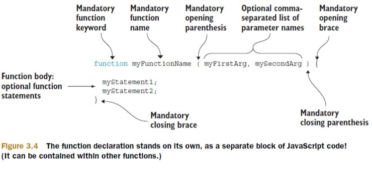
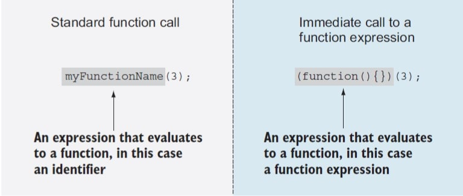
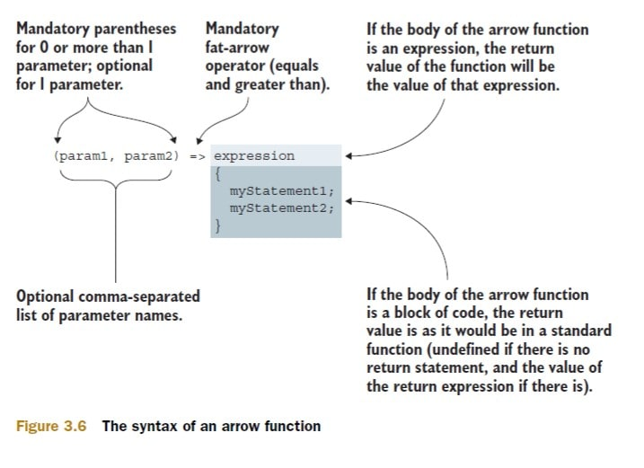
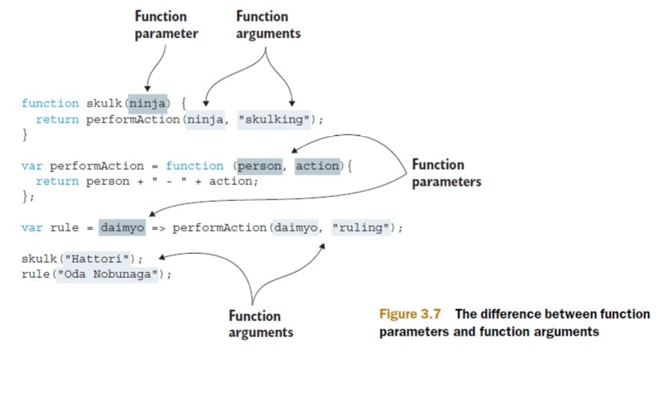
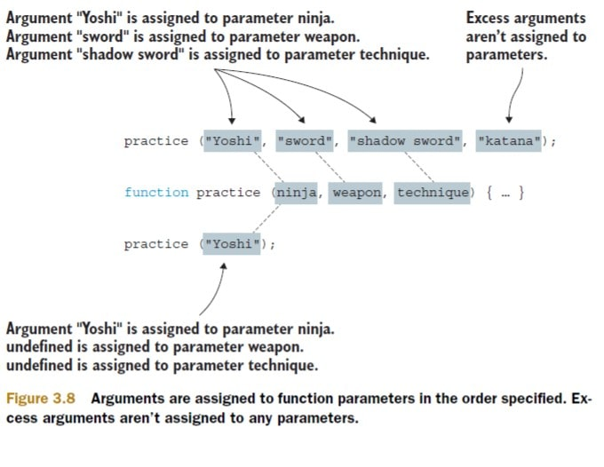

# Chapter 3: First-class functions for the novice: definitions and arguments

## Table of Contents

- [Chapter 3: First-class functions for the novice: definitions and arguments](#chapter-3-first-class-functions-for-the-novice-definitions-and-arguments)
  - [Table of Contents](#table-of-contents)
  - [Chapter Overview](#chapter-overview)
  - [Questions To Consider](#questions-to-consider)
  - [3.0 Introduction](#30-introduction)
  - [3.1 - What's With The Functional Difference?](#31---whats-with-the-functional-difference)
    - [3.1.1 - Functions As First-class Objects](#311---functions-as-first-class-objects)
    - [3.1.2 - Callback Functions](#312---callback-functions)
    - [Callback Example #1](#callback-example-1)
    - [Callback Example #2](#callback-example-2)
    - [3.1.3 - Sorting With A Comparator](#313---sorting-with-a-comparator)
  - [3.2 - Fun With Functions As Objects](#32---fun-with-functions-as-objects)
    - [3.2.1 - Storing Functions](#321---storing-functions)
    - [3.2.2 - Self-memoizing Functions](#322---self-memoizing-functions)
  - [3.3 - Defining Functions](#33---defining-functions)
    - [3.3.1 Function Declarations and Function Expressions](#331-function-declarations-and-function-expressions)
      - [Function declarations](#function-declarations)
      - [Function Expressions](#function-expressions)
      - [Immediate Functions](#immediate-functions)
    - [3.3.2 -  Arrow functions](#332----arrow-functions)
  - [3.4 - Arguments and function parameters](#34---arguments-and-function-parameters)
    - [3.4.1 Rest parameters](#341-rest-parameters)

## Chapter Overview

This chapter covers:

* Why understanding functions is so crucial
* How functions are first-class objects
* The ways to define a function
* The secrets of how parameters are assigned


## Questions To Consider

* In what situations might callback functions be used synchronously? What about Asynchronously?
* What's the difference between an arrow function and a function expression?
* Why might you need to use the default parameter values in a function?

## 3.0 Introduction

**TLDR:** 
* JavaScript **functions** are **first-class objects**, or **first-class citizens** as they’re often called. They coexist with, and **can be treated like, any other JavaScript object**.
* JavaScript **functions** can be **referenced by variables**, **declared with literals**, and **even passed as function parameters**.

## 3.1 - What's With The Functional Difference?

First, lets take a look at the Object capabilities in JavaScript:

* They can be created via literals: {}
* They can be assigned to variables, array entries, and properties of other objects:
```js
// Assigns a new object to a variable
var ninja = {};
// Adds a new object to an array
ninjaArray.push({});
// Assigns a new object as a property of another object
ninja.data = {};
```
* They can be passed as arguments to functions:
```js
function hide(ninja) {
  ninja.visibility = false;
}
// A newly created object passed as an argument to a function
hide({});
```
* They can be returned as values from functions:
  
```js
function returnNewNinja() {
  // returns a new object from a function
  return {};
}
```
* They can possess properties that can be dynamically created and assigned

```js
var ninja = {};
// Creates a new property of an object
ninja.name = "Hanzo";
console.log(ninja.name); // prints "Hanzo"
```

### 3.1.1 - Functions As First-class Objects

Since functions are **first-class objects**, they can do the same things as objects:

* They can be created via literals:

```js
function ninjaFunction() {}
```
* They can be assigned to variables, array entries, and properties of other objects:
```js
// Assigns a new function to a variable
var ninjaFunction = function() {};
// Adds a new function to an array
ninjaArray.push(function(){});
// Assigns a new function as a property of another object
ninja.data = function(){};
```
* They can be passed as arguments to functions:
```js
function call(ninjaFunction) {
  ninjaFunction();
}
// A newly created object passed as an argument to a function
call(function(){});
```
* They can be returned as values from functions:
  
```js
function returnNewNinjaFunction() {
  // returns a new object from a function
  return function(){};
}
```
* They can possess properties that can be dynamically created and assigned

```js
var ninjaFunction = function(){};
// Creates a new property of an object
ninjaFunction.name = "Hanzo";
console.log(ninjaFunction.name); // prints "Hanzo"
```

*NOTE:* Whatever we can do with objects, we can do with functions as well. Functions are objects, just with an additional, special capability of being invokable: Functions can be called or invoked in order to perform an action.


### 3.1.2 - Callback Functions

The term **callback** stems from the fact that we’re establishing a function that other code will later “call back” at
an appropriate point of execution.


### Callback Example #1

```js
let text = "Domo arigato";
console.log("Before defining functions!");

function useless(ninjaCallback) {
  // defines a function that takes a callback function and immediately invokes it 
  console.log("In useless function");
  return ninjaCallback();
}

// Defines a simple function that returns a global variable
function getText() {
  console.log("In getText function");
  return text;
}

console.log("Before making all the calls");
// Calls our useless function with the getText function as a callback
let secondText = useless(getText)

// If they match, console.log success message
if (text === secondText) {
  console.log("The useless function works! " + text);
}

console.log("After the calls have been made5\");

```

### Callback Example #2

```js
document.body.addEventListener("mousemove", function() {
  let second = document.getElementById("second");
  addMessage(second, "Event: mousemove");
})
```

### 3.1.3 - Sorting With A Comparator

Let’s say that we have an array of numbers in a random order: 0, 3, 2, 5, 7, 4, 8, 1. That order might be just fine, but chances are that, sooner or later, we’ll want to rearrange it.

Instead of letting the sort algorithm decide what values go before other values, we’ll provide a function that performs the comparison. We’ll give the sort algorithm access to this function as a callback, and the algorithm will call the callback whenever it needs to make a comparison. The callback is expected to:
* Return a positive number if the order of the passed values should be reversed
* Return a negative number if not, 
* Return zero if the values are equal

Subtracting the compared values produces the desired return value to sort the array:

```js
let values = [0, 3, 2, 5, 7, 4 8, 1];
let sortedValues = values.sort(function (value1, value2) {
  return value1 - value2;
});

console.log(sortedValues); // prints [0, 1, 2, 3, 4, 5, 7, 8]

```

## 3.2 - Fun With Functions As Objects

One capability that might be surprising is that there’s nothing stopping us from attaching properties to functions:

```js
// Create an object
let ninja = {}
// Add a new property to the object
ninja.name = "hitsuke";
console.log(ninja.name); // prints "hitsuke"

// Create a new function
let wieldSword = function(){};
// Assign a new property to the function
wieldSword.swordType = "katana"; 
console.log(wieldSword.swordType); // prints "katana"
```

Let’s look at a couple of the more interesting things that can be done with this capability:

* Storing functions in a collection allows us to easily manage related functions—for example, callbacks that have to be invoked when something of interest occurs.
* Memoization allows the function to remember previously computed values,
thereby improving the performance of subsequent invocations.

### 3.2.1 - Storing Functions

Let's take a look at storing a collection of unique functions:

```js
/**
* nextId keeps track of the next available id to be assigned
* cache is an object that will serve as a caches in which we'll store functions
* add function ass to the cache, but only if they are unique
*/
let store = {
  nextId: 1,
  cache: {},
  add: function(fn) {
    // if the id does not exist
    if (!fn.id) {
      // get nextId
      fn.id = this.nextId++;
      //add function value to cache with the id as the property key
      this.cache[fn.id] = fn;
      // return boolean for future check
      return true;
    }
  }
}

function ninja(){};
if (store.add(ninja)) {
  console.log("Function was safely added.");
} else if (!store.add(ninja)) {
  console.log("But it was only added once.");
}
```

### 3.2.2 - Self-memoizing Functions

**Memoization** is the process of building a function that’s capable of remembering its previously computed values.

Whenever a function computes its result, we store that result alongside the function arguments. In this way, when another invocation occurs for the same set of arguments, we can return the previously stored result, instead of calculating it anew.

As an example, let’s look at a simplistic (and certainly not particularly efficient) algorithm for computing prime numbers:

```js
function isPrime(value) {
  // if cache is not created yet
  if (!isPrime.answers) {
    // create cache
    isPrime.answers = {};
  }
  // checks for cached values
  if (isPrime.answers[value] !== undefined) {
    // if there is a match, return it
    return isPrime.answers[value];
  }

  var prime = value !== 1; // 1 is not a prime number

  for (let i = 2; i < value; i++) {
    if (value % i === 0) {
      prime = false;
      break;
    }
  }
  // Stores the computed value
  return isPrime.answers[value] = prime;
}

// If it returns true, its a prime number
if (isPrime(5)) {
  console.log("5 is prime!");
}
// If this returns true, it is stored in the cache
if (isPrime.answers[5]) {
  console.log("The answer was cached!");
}
```

This approach has two major advantages:

* The end user enjoys performance benefits for function calls asking for a previously computed value.
* It happens seamlessly and behind the scenes; neither the end user nor the page author needs to perform any special requests or do any extra initialization in order to make it all work.

But it’s not all roses and violins; its disadvantages may need to be weighed against its advantages:

* Any sort of caching will certainly sacrifice memory in favor of performance.
* Purists may consider that caching is a concern that shouldn’t be mixed with the business logic; a function or a method should do one thing and do it well. But don’t worry; in chapter 8, you’ll see how to tackle this complaint.
* It’s difficult to load-test or measure the performance of an algorithm such as this one, because our results depend on the previous inputs to the function.

## 3.3 - Defining Functions 

You can define functions into 4 groups

* __Function Declarations and Function Expressions__

```js
// function declaration
function myFun() { return 1; }

// function expression
const mySecondFun = function() {
  return 2;
}
```

* __Arrow Functions (AKA Lambda Functions)__

```js
// function declaration
function double (myArg) {
  return myArg * 2; 
}
// Arrow function expression
const doubleInEs6 = myArg => myArg * 2;
```

* __Function Constructors (rarely used)__

```js
new Function('a', 'b', 'return a + b');
```

* __Generator Functions__ - This ES6 addition to JavaScript enable us to create functions that, unlike normal functions, can be exited and reentered later in the application execution, while keeping the values of their variables across these re-entrances. We can define generator versions of function declarations, function expressions, and function constructors:

```js
function* myGen(){ yield 1;
```

### 3.3.1 Function Declarations and Function Expressions

#### Function declarations

The most basic way of defining a function in JavaScript is by using function declarations (see below):



Every function:

* Starts with a mandatory `function` keyword
* followed by a mandatory function name
* A list of optional comma-separated `parameter` names enclosed within mandatory parenthesis
* A function body that is enclosed with an opening/closing {}


**NOTE:** * JavaScript functions must be placed on its own, as a separate JavaScript statement (but can be contained within another function or a block of code)

Here is a few examples of properly declared functions:

```js
// Defines function samurai in the global scope
function samurai() {
  return "samurai here";
}

// Defines function ninja in the global scope
function ninja() {
  //Defines function hiddenNinja in the ninja function scope
  function hiddenNinja() {
    return "ninja here";
  }

  return hiddenNinja();
}
```

#### Function Expressions

JavaScript are `first-class objects`, which, among other things, means that they can be created via literals, assigned to variables and properties, and used as arguments and return values to and from other functions.

So in this case, we can assign a variable to represent a function literal.

Such functions that are always a part of another statement (for example, as the right side of an assignment expression, or as an argument to another function) are called `function expressions`.

Function expressions are great because they allow us to define functions exactly where we need them, in the process making our code easier to understand.


The following example shows the difference between function declarations and function expressions:

```js
/* function declarations are separate statements of JavaScript code, but can be contained within the body of other functions. */

// Standalone function declaration
function myfunctionDeclaration() {
  // inner function declaration
  function innerFunction() {}
}

/* In contrast function expressions are always a part of another statement. */

// Function expression as a part of a variable declaration assignment
var myFunc = function() {};
// function expression as an argument of a function call
myFunc(function() {
  // function expression as a function return value
  return function() {};
});

// Named function expression as part of a function call that will be immediately invoked
(function namedFunctionExpression() {
  return function(){};
})();

// Function expressions that will be invoked, as arguments to unary operators
console.log(+function() {}); // prints NaN
console.log(-function() {}); // prints NaN
console.log(!function() {}); // prints false
console.log(~function() {}); // prints -1
```

#### Immediate Functions

Let's take a look a a function call and a IIFE (Immediately invoked function expression):



*NOTE:* You might ask yourself Why do we even need () around the IIFE? The reason is purely syntactical. The JavaScript parser has to be able to easily differentiate between function declarations and function expressions.

### 3.3.2 -  Arrow functions

Arrow functions are syntactical sugar to make code more readable. Let's visit our sort example from earlier:

```js
let values = [0, 3, 2, 5, 7, 4, 8, 1];
values.sort(function(val1, val2) {
  return val1 - val2;
})
```

Now lets use an arrow function for the callback within sort:

```js
let values = [0, 3, 2, 5, 7, 4, 8, 1];
values.sort((val1, val2) => val-1 - val2);
```

That is a bit more succinct. Now let’s deconstruct the syntax of an arrow function, starting with the simplest
possible way:

```js
parameter => expression
```

This arrow function takes a parameter and returns the value of an expression. Here are a few more examples:

```js

// first using a function expression
const greet= function("Oishi") {
  return "Greetings " + name
}
if(greet("Oishi") === "Greetings Oishi") {
  console.log("Oishi is properly greeted");
}

// Now using an arrow function
const anotherGreet = name => "Greetings " + name;
if (anotherGreet("Oishi") === "Greetings Oishi") {
  console.log("Again, Oishi is properly greeted");
}
```

Here is a visual example of an arrow function:



If arrow functions require more than one line, {} around the function body will be required like so:

```js
const anotherGreet = name => {
  let helloString = 'Greetings ';
  return helloString + name;
}
```

**NOTE:** If there’s no return statement, the result of the function invocation will be `undefined`, and if there is, the result will be the value of the return expression.

## 3.4 - Arguments and function parameters

When discussing functions, we often use the terms argument and parameter almost interchangeably, as if they were more or less the same thing. But now, let’s make a clear difference between the two:

* A `parameter` is a variable that we list as part of a function definition.
* An `argument` is a value that we pass to the function when we invoke it.



As you can see, a function parameter is specified with the definition of the function, and all types of functions can have parameters:
* Function declarations (the `ninja` parameter to the `skulk` function)
* Function expressions (the `person` and `action` parameters to the `performAction` function)
* Arrow functions (the `daimy`o parameter)

Arguments, on the other hand, are linked with the invocation of the function; they’re values passed to a function at the time of its invocation:

* The string 'Hattori' is passed as an argument to the skulk function.
* The string 'Oda Nobunaga' is passed as an argument to the rule function.
* The parameter `ninja` of the skulk function is passed as an argument to the `performAction` function.

When a list of arguments is supplied as a part of a function invocation, these arguments are assigned to the parameters in the function definition in the order specified:

* The first argument gets assigned to the first parameter
* The second argument to the second parameter
* and so on.
  
If we have a different number of arguments than parameters, no error is raised. JavaScript is perfectly fine with this situation and deals with it in the following way. If more arguments are supplied than there are parameters, the “excess” arguments aren’t assigned to parameter names.



### 3.4.1 Rest parameters